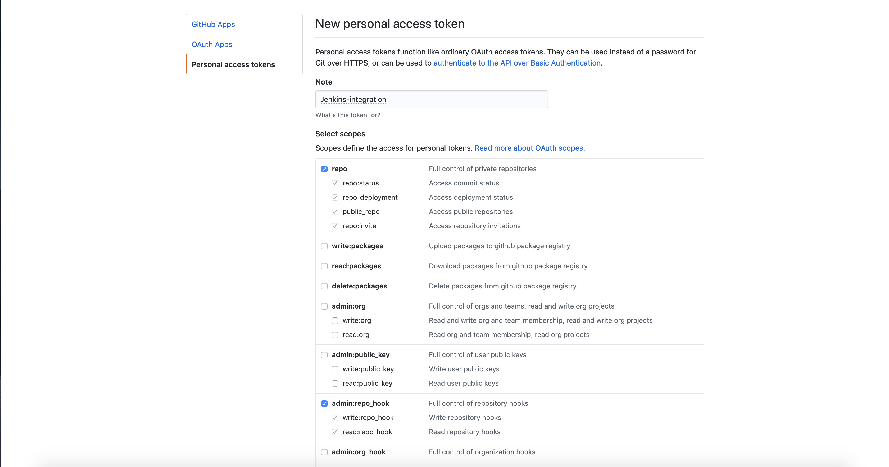
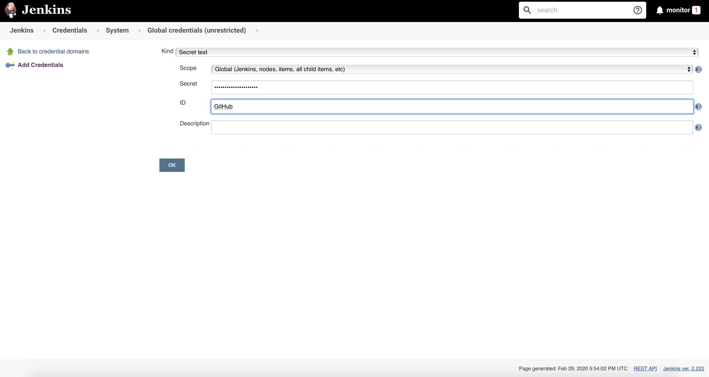
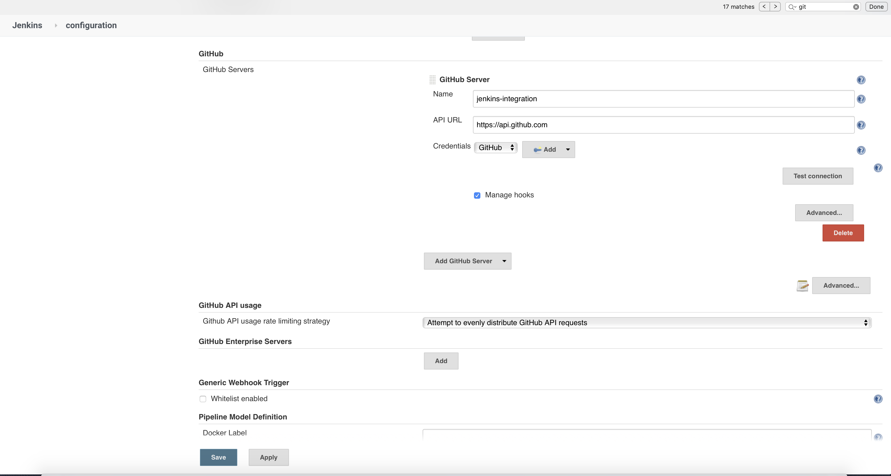
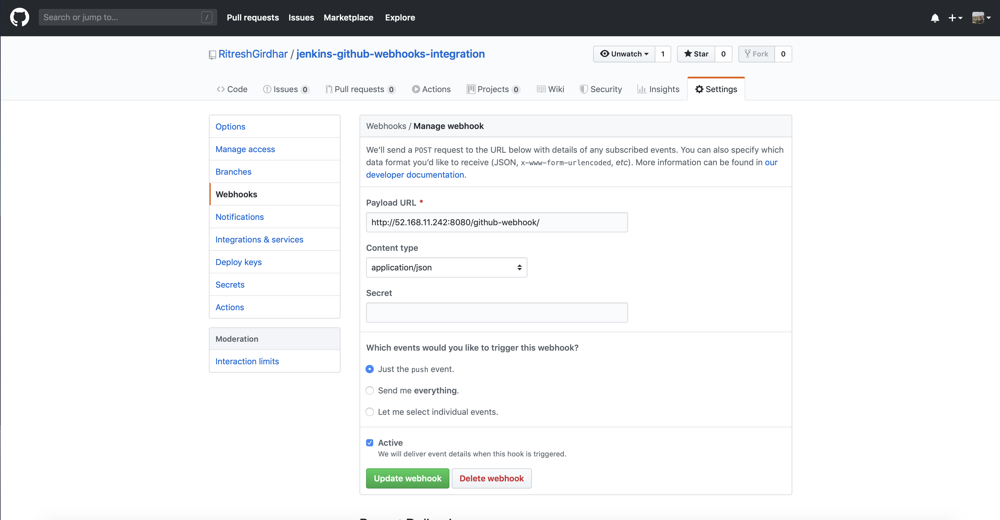
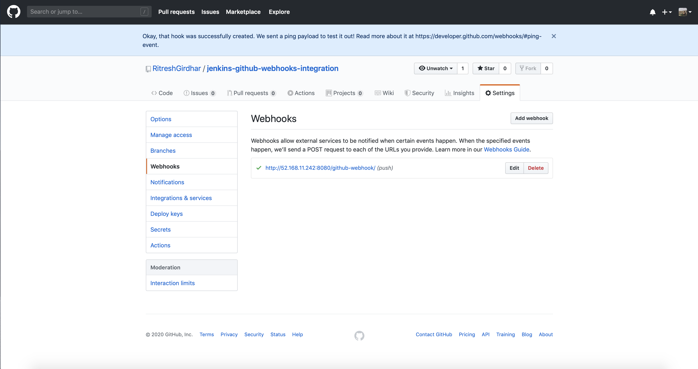
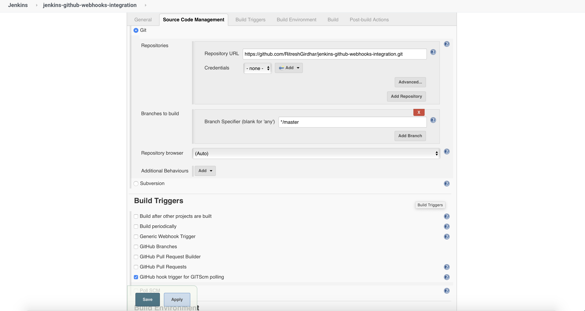
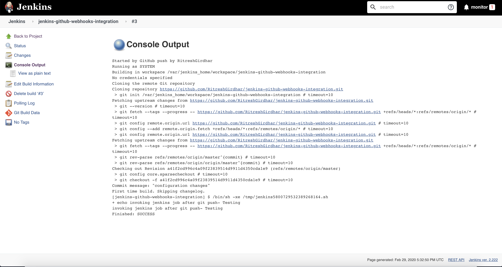
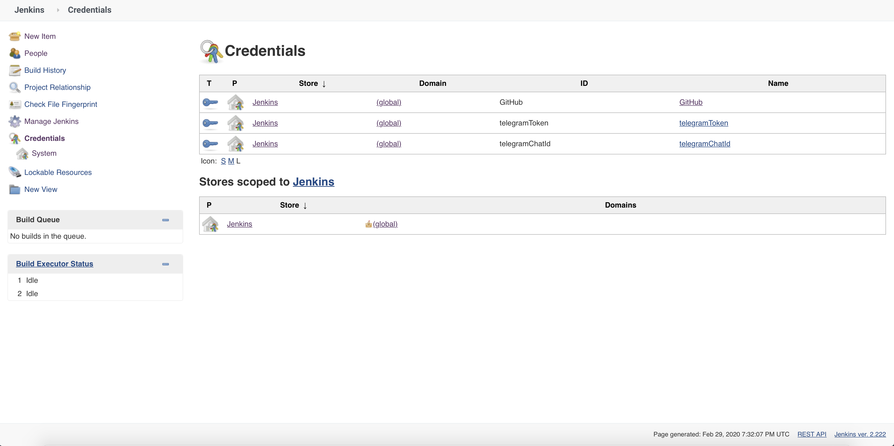
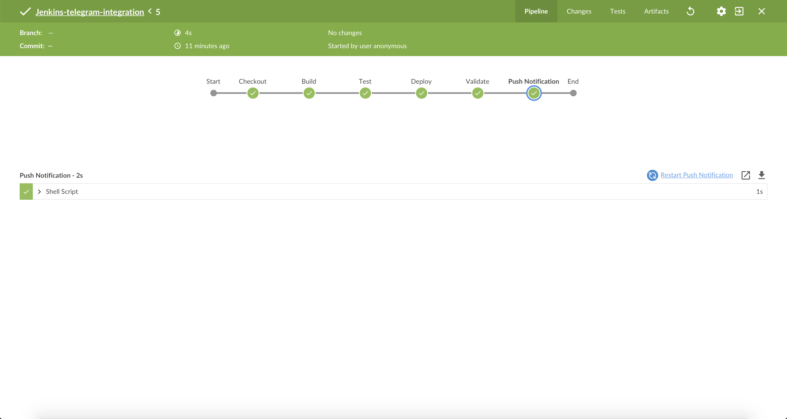

# Continuous-integration - Github Jenkins Webhooks integration - Send notification to telegram via Jenkins
For every commit or MR merged to master branch Github webhook will generate event to Jenkins job which will build + test master branch 
and push notification through telegram

### Pre-requisite 
* You should have basic knowledge of docker + jenkins + git + declarative pipeline

## Set up Jenkins
```
docker run -d -p8080:8080 jenkins/jenkins
```

## Github Jenkins WebHooks integration

* Goto Github Account -> Setting -> Developer Settings -> Personal Access Token. Choose repo, admin.repo options and generate token. Do copy the token.


* Configure Github personal token in Jenkins Configuration Before that Goto Jenkins -> Credentials -> Global Credentials -> Add credentials -> Select Secret text option and copy the token 


* Now goto Manage Jenkins -> Configure System -> Add github server and Configure github account and select the credential which you created in above step.


* Now Let's set up Github Webhook. Goto Github Repo -> Setting -> Webhook -> Add Webhook. Fill the jenkins server url with respective format plus do select the type of push event


* Once webhook is integrated you will see green tick sign as a successful integration.

  
  
* Now lets create a sample jenkins job. Goto jenkins server, create any kind of job. For this demo i am creating free style project.

* Configure the jenkins job and provide Git server details plus do select option `GitHub hook trigger for GITScm polling option.`


* Now let's test the integration by Pushing some code changes in master branch. Once its done check the invoked Jenkins job console.



 
## Telegram Bot Set up
* Open Telegram App. Search @BotFater , send /newbot command and then send bot name and the user name.

* Once Bot is set up invoke below api using http api token. In response you will find chatId value.
```
curl -ivk https://api.telegram.org/bot<http-token>/getUpdates
``` 
* Configure Chat ID and Http Token in jenkins as a secret Credentials.


* Configure below stage in jenkins job pipeline
```
stage('Push Notification') {

         steps {

            script{

                withCredentials([string(credentialsId: 'telegramToken', variable: 'TOKEN'),
                string(credentialsId: 'telegramChatId', variable: 'CHAT_ID')]) {
                   sh """
                    curl -s -X POST https://api.telegram.org/bot${TOKEN}/sendMessage -d chat_id=${CHAT_ID} -d text="Commited changes are test and build state is OK"
                   """
                }
            }
         }
      }
```
* After successful build , job state would be


* Don't forget to check Telegram messgae


